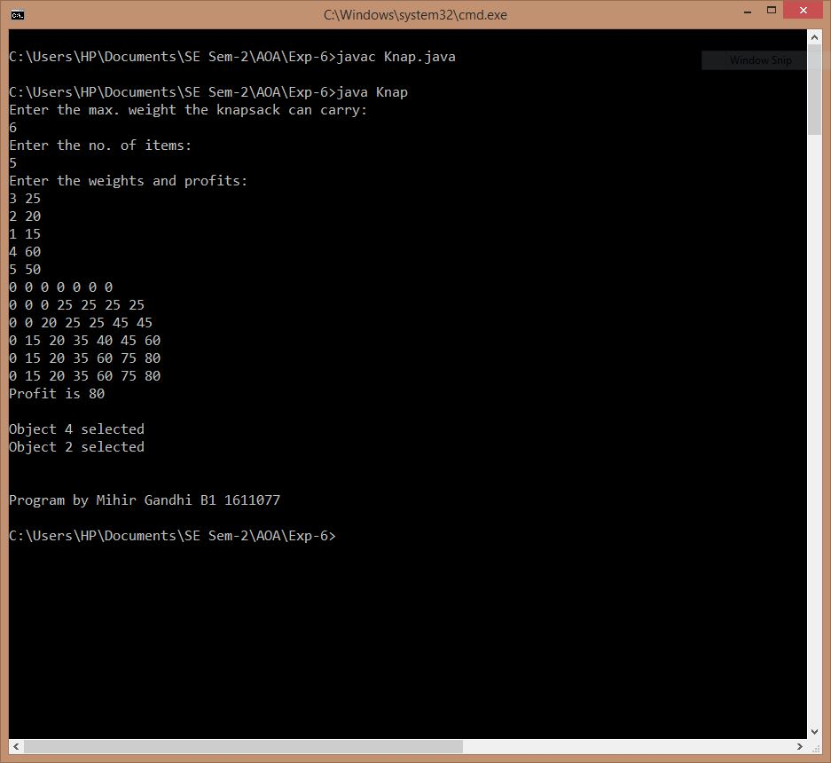

## 0-1 Knapsack Problem

-----------------------------------------
### Problem Definition:
Given a set of items, each with a weight and a value, determine a subset of items to include in a knapsack so that the total weight is less than or equal to a given limit and the total value is as large as possible. You cannot break an item, either pick the complete item or don’t pick it (0-1 property).

Strategy: Dynamic Programming

------------------------------------------
### Output:

    

------------------------------------------
### Complexity Analysis:

* Time Complexity: **O(n * W)** 
    
* Space Complexity: **O(n * W)** 

where n = number of items and W = capacity of the knapsack
