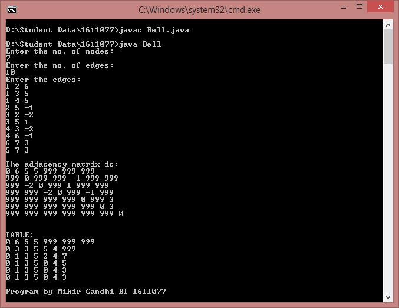

## Bellman Ford Algorithm

-----------------------------------------
### Problem Definition:
Write a program to compute shortest paths from a single source vertex to all of the other vertices in a weighted digraph using Bellman Ford Algorithm. 

Strategy: Greedy

------------------------------------------
### Output:

    

------------------------------------------
### Complexity Analysis:

* Time Complexity: **O(V * E)** 
* Space Complexity: **O(V * E)** 

where V = number of vertices and E = number of edges
