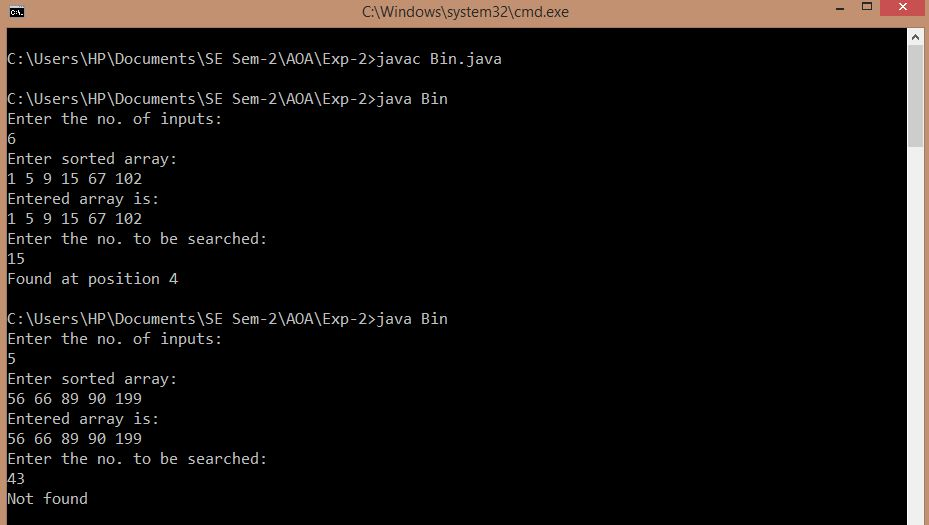

## Binary Search

-----------------------------------------
### Problem Definition:
Write a program to implement Binary Search on a sorted array of numbers.

Strategy: Divide and Conquer

------------------------------------------
### Output:

    

------------------------------------------
### Complexity Analysis:

* Time Complexity: **O(log(n))** 
* Space Complexity: **O(1)** 

where n = size of the input array
