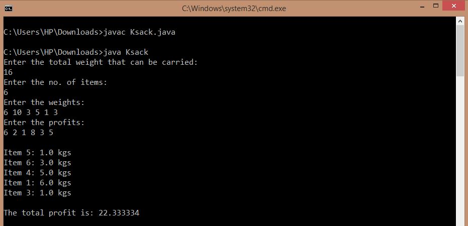

## Fractional Knapsack Problem

-----------------------------------------
### Problem Definition:
Given a set of items, each with a weight and a value, determine a subset of items to include in a knapsack so that the total weight is less than or equal to a given limit and the total value is as large as possible. Items can be broken into smaller pieces, and thus, a fraction of an item can also be included. 

Strategy: Greedy

------------------------------------------
### Output:

    

------------------------------------------
### Complexity Analysis:

* Time Complexity: **O(n^2)** 
  
  (This is because Insertion sort was used. Time complexity can be brought down to O(n * log n) by using Merge Sort and p/w ratio.) 
  
* Space Complexity: **O(n)** 

where n = number of items
