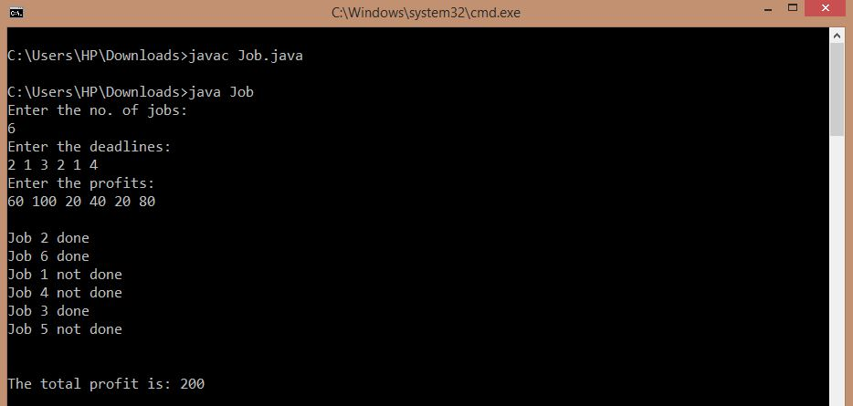

## Job Sequencing Problem

-----------------------------------------
### Problem Definition:
Given an array of jobs where every job has a deadline and associated profit if the job is finished before the deadline. It is also given that every job takes a single unit of time, so the minimum possible deadline for any job is 1. Write a program to maximize total profit if only one job can be scheduled at a time.

Strategy: Greedy

------------------------------------------
### Output:

    

------------------------------------------
### Complexity Analysis:

* Time Complexity: **O(n^2)** 
* Space Complexity: **O(n)** 

where n = total number of jobs
