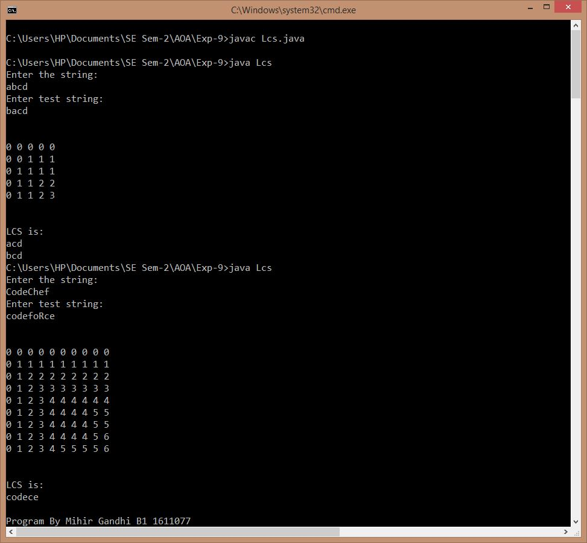

## Longest Common Subsequence

-----------------------------------------
### Problem Definition:
Write a program to compute longest common subsequence for the given two strings.

A subsequence is a sequence that appears in the same relative order, but not necessarily contiguous. For example, “abc”, “abg”, “bdf”, “aeg”, ‘”acefg”, .. etc are subsequences of “abcdefg”.

Strategy: Dynamic Programming

------------------------------------------
### Output:

    

------------------------------------------
### Complexity Analysis:

* Time Complexity: **O(m * n)** 
* Space Complexity: **O(m * n)** 

where m = length of first string and n = length of second string

