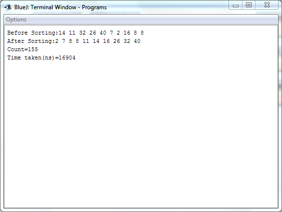

## Merge Sort

-----------------------------------------
### Problem Definition:
Write a program to implement Merge Sort on an array of integers.

------------------------------------------
### Output:

    

------------------------------------------
### Complexity Analysis:

* Time Complexity: **O(n * log n)** 
* Space Complexity: **O(n)** 

where n = size of the input array
