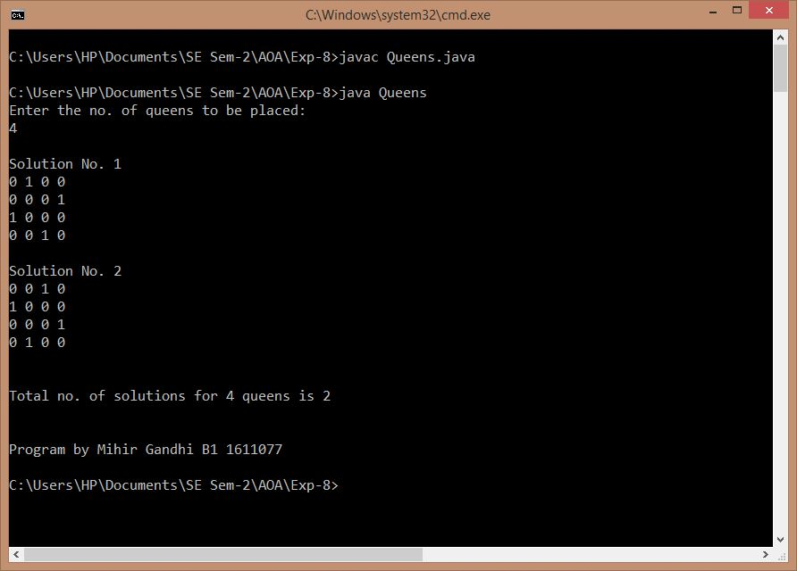
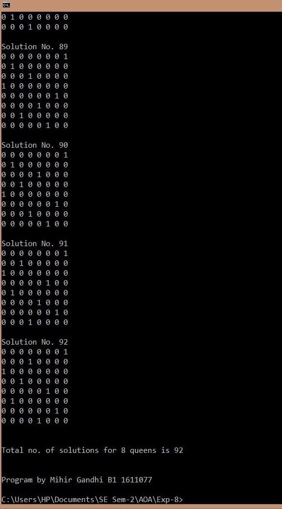

## N Queen Problem

-----------------------------------------
### Problem Definition:
Write a program to solve the N Queen Problem. 

The N Queen is the problem of placing N chess queens on an N×N chessboard so that no two queens attack each other.

Strategy: Backtracking

------------------------------------------
### Output:

* N = 4

    

* N = 8

    

------------------------------------------
### Complexity Analysis:

* Time Complexity: **O(N!)** 
* Space Complexity: **O(N^2)** 

where N = number of queens to be placed on the board
