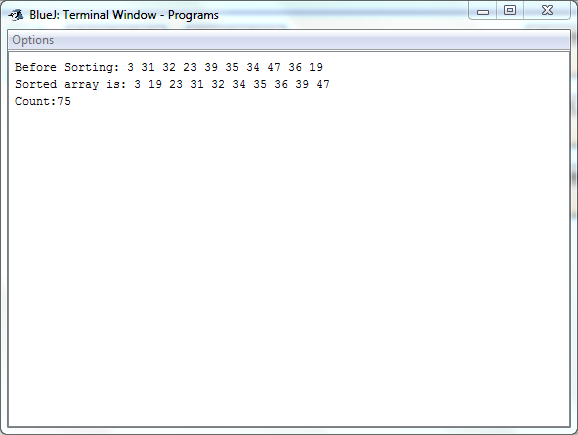

## Quick Sort
-----------------------------------------
### Problem Definition:
Write a program to implement Quick Sort on an array of integers.

Strategy: Divide and Conquer

------------------------------------------
### Output:

    

------------------------------------------
### Complexity Analysis:

* Time Complexity: **O(n^2)** 
* Space Complexity: **O(1)** 

where n = size of the input array
