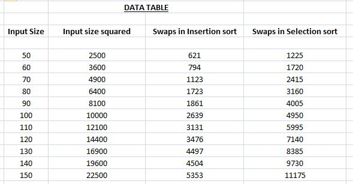
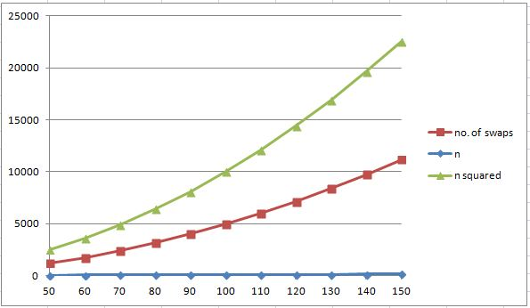

## Selection Sort

-----------------------------------------
### Problem Definition:
Write a program to implement Selection Sort on an array of integers. Compare how the number of swaps increase with the size of the input.  

------------------------------------------
### Output:

    

    

------------------------------------------
### Complexity Analysis:

* Time Complexity: **O(n^2)** 
* Space Complexity: **O(1)** 

where n = size of the input array
