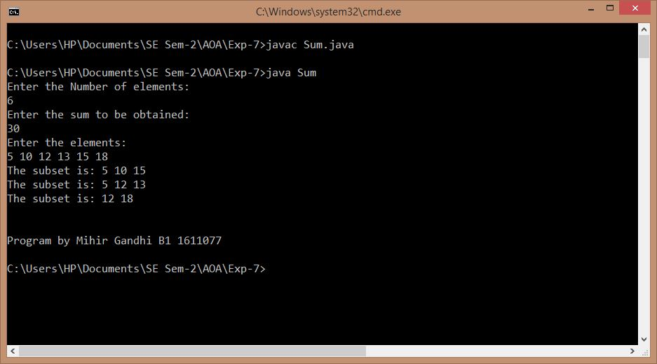

## Sum of Subsets Problem

-----------------------------------------
### Problem Definition:
Write a program to implement find the subsets of a given array of integers such that the sum of all elements in the subset is equal to a given integer.

Strategy: Backtracking

------------------------------------------
### Output:

    

------------------------------------------
### Complexity Analysis:

* Time Complexity: **O(2^n)** 
* Space Complexity: **O(n)** 

where n = size of the input array
